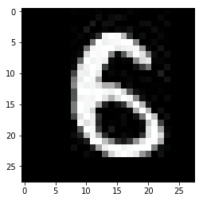

# [Kaggle] Project: Digit Recognizer

Project code for [Kaggle's Digit Recognizer](https://www.kaggle.com/c/digit-recognizer) competition 2018.

## Getting Started

This project is the result of a personal desire to develop an image classifier for handwritten digits. After a lot of research I found a good approach on the website of Kaggle. The project data are also from the above mentioned competition.

### Prerequisites

Thinks you have to install or installed on your working machine:

* Python 3.7
* Numpy (win-64 v1.15.4)
* Pandas (win-64 v0.23.4)
* Matplotlib (win-64 v3.0.2)
* Torchvision (win-64 v0.2.1)
* PyTorch (win-64 v0.4.1)

### Environment:
* [Miniconda](https://conda.io/miniconda.html) or [Anaconda](https://www.anaconda.com/download/)

### Installing

Use the package manager [pip](https://pip.pypa.io/en/stable/) or
[miniconda](https://conda.io/miniconda.html) or [Anaconda](https://www.anaconda.com/download/) to install your packages.  
A step by step guide to install the all necessary components in Anaconda for a Windows-64 System:
```
conda install -c conda-forge numpy
conda install -c conda-forge pandas
conda install -c conda-forge matplotlib
pip install torchvision
conda install -c pytorch pytorch
```

## Image Data Description (Kaggle)
The data files train.csv and test.csv contain gray-scale images of hand-drawn digits, from zero through nine.

Each image is 28 pixels in height and 28 pixels in width, for a total of 784 pixels in total. Each pixel has a single pixel-value associated with it, indicating the lightness or darkness of that pixel, with higher numbers meaning darker. This pixel-value is an integer between 0 and 255, inclusive.

The training data set, (train.csv), has 785 columns. The first column, called "label", is the digit that was drawn by the user. The rest of the columns contain the pixel-values of the associated image.

Each pixel column in the training set has a name like pixelx, where x is an integer between 0 and 783, inclusive. To locate this pixel on the image, suppose that we have decomposed x as x = i * 28 + j, where i and j are integers between 0 and 27, inclusive. Then pixelx is located on row i and column j of a 28 x 28 matrix, (indexing by zero).

For example, pixel31 indicates the pixel that is in the fourth column from the left, and the second row from the top, as in the ascii-diagram below.

Visually, if we omit the "pixel" prefix, the pixels make up the image like this:
```
000 001 002 003 ... 026 027
028 029 030 031 ... 054 055
056 057 058 059 ... 082 083
 |   |   |   |  ...  |   |
728 729 730 731 ... 754 755
756 757 758 759 ... 782 783
```
The test data set, (test.csv), is the same as the training set, except that it does not contain the "label" column.

Your submission file should be in the following format: For each of the 28000 images in the test set, output a single line containing the ImageId and the digit you predict. For example, if you predict that the first image is of a 3, the second image is of a 7, and the third image is of a 8, then your submission file would look like:
```
ImageId,Label
1,3
2,7
3,8
(27997 more lines)
```
The evaluation metric for this contest is the categorization accuracy, or the proportion of test images that are correctly classified. For example, a categorization accuracy of 0.97 indicates that you have correctly classified all but 3% of the images.

## Running the project

The original image-data [train.csv](./data/train.csv) file includes 42000 raw-image datas for 28x28 pixel grayscale images of digits and the label of each image in front of the raw data set.

First, you have to convert the raw image data's from the csv-file to real grayscale images.
In these convertion steps, the input training data's will be separated to a training-set (4/6), a validation-set (1/6) and a test-set (1/6).

### Convert train.csv file to real grayscale images

First, you need to convert the raw-image data from file train.csv to real grayscale images.

```
convert_data_to_MNIST.py
```

### Parameters of convertion

To change the folder input and output folder, you can change the following constants inside the python file:

```python
CONST_OUTPUT_TRAIN_FOLDER = "./MNIST_data/train/"
CONST_OUTPUT_TEST_FOLDER = "./MNIST_data/test/"
CONST_OUTPUT_VALID_FOLDER = "./MNIST_data/valid/"

CONST_DATA_NN_FOLDER = "./data/"
```

### Ouput of convertion to real grayscale images

```
---------------------------------------------------------------------
loading train-data: train.csv ... done.
train_data (lines x columns) :  (42000, 785)
---------------------------------------------------------------------
percent: 100 %  ------ file: ./MNIST_data/test/9/test_image_41999.jpg   
----------------- converting training complete ----------------------
```

After this you will find grayscale images separated in train- / test- and valid-sets in the folder `./MNIST_data/`.

### Train the model

To train the neural network (CNN), start the following python file:
```
main_train.py
```

All needed parameters are set and you can just run it to the results.

In general, the training function is configured that the model-state will saved on
every step the actual validation loss is decreased and lower as the one before.
This save file will be stored and named by the global constant: `param_save_filename_validation_loss`

After the whole training section, the whole model with some parameters will be saved in
a checkpoint file. This can be configured by the global constant:
`param_save_filename`

In case you want to re-train the model again, after some training and you don't want to
start from the scratch. You can load the best-validation-loss-save-file after the model
is created and uncomment the 3rd line (which start with `model_nn.load_state_dictionary(...)`):

```python
# --------- create model --------
model_nn = cnn.CNNNetwork( param_data_directory, param_save_filename_validation_loss, param_output_size, param_hidden_units, param_learning_rate, param_gpu )
# load previous save model from the validation loss file
#model_nn.load_state_dictionary( param_save_filename_validation_loss )
```

In this case, your best-validation-loss-save-file will be loaded and the model will start to train from this point.

**ATTENTION:** Be sure, your network parameters like output-size and hidden-units are the same as you saved the validation-loss-file.

### Parameters of training

To change to input folder, the output size and some other parameters for the neural network, you can adapt these global constants inside the python file.

```python
# ---- set parameters ---------------
param_data_directory = "MNIST_data"         # default: MNIST_data
param_output_size = 10                      # 10 - original
param_save_filename = "checkpoint.pth"      # checkpoint.pth
param_save_filename_validation_loss = "checkpoint_validation_model.pth"
param_save_directory = "./"                 # ./
param_learning_rate = 0.001                 # 0.001
param_hidden_units = 512                    # 512
param_epochs = 3                            # 3
param_print_every_steps = 20                # 20
param_gpu = True                            # True or False
# -----------------------------------
```

### Output of training
```bash
----- running with params -----
data directory:  MNIST_data
save directory:  ./
learning rate:   0.001
hidden units:    512
epochs:          3
gpu:             True
-------------------------------
cnn neural network ...
load image data ... done
create model ... done
initialized.
start training in -gpu- mode ...
adjust learning rate in epoch 1 to 0.001
epoch: 1/3..  training loss: 1.9140..  validation loss: 2.1263..  validation accuracy: 0.4642     saving model ...
epoch: 1/3..  training loss: 1.4975..  validation loss: 1.4882..  validation accuracy: 0.6012     saving model ...
epoch: 1/3..  training loss: 1.2465..  validation loss: 1.1469..  validation accuracy: 0.6630     saving model ...
epoch: 1/3..  training loss: 1.0826..  validation loss: 0.9405..  validation accuracy: 0.7030     saving model ...
epoch: 1/3..  training loss: 1.0147..  validation loss: 0.7908..  validation accuracy: 0.7678     saving model ...
epoch: 1/3..  training loss: 0.8401..  validation loss: 0.7744..  validation accuracy: 0.7470     saving model ...
epoch: 1/3..  training loss: 0.7997..  validation loss: 0.5522..  validation accuracy: 0.8356     saving model ...
epoch: 1/3..  training loss: 0.8026..  validation loss: 0.5758..  validation accuracy: 0.8297     
epoch: 1/3..  training loss: 0.7686..  validation loss: 1.2378..  validation accuracy: 0.6027     
epoch: 1/3..  training loss: 0.6253..  validation loss: 0.6213..  validation accuracy: 0.8003     
epoch: 1/3..  training loss: 0.6962..  validation loss: 0.4294..  validation accuracy: 0.8720     saving model ...
epoch: 1/3..  training loss: 0.6369..  validation loss: 0.4598..  validation accuracy: 0.8718     
epoch: 1/3..  training loss: 0.6764..  validation loss: 0.4090..  validation accuracy: 0.8826     saving model ...
...
epoch: 3/3..  training loss: 0.2202..  validation loss: 0.1290..  validation accuracy: 0.9620     saving model ...
epoch: 3/3..  training loss: 0.2302..  validation loss: 0.1323..  validation accuracy: 0.9603     
epoch: 3/3..  training loss: 0.2535..  validation loss: 0.1291..  validation accuracy: 0.9620     
epoch: 3/3..  training loss: 0.2277..  validation loss: 0.1312..  validation accuracy: 0.9615     
epoch: 3/3..  training loss: 0.2648..  validation loss: 0.1263..  validation accuracy: 0.9618     saving model ...
epoch: 3/3..  training loss: 0.2106..  validation loss: 0.1259..  validation accuracy: 0.9628     saving model ...
-- done --
duration:  00:13:49
save model to:  ./checkpoint.pth ... done
calculate accuracy on test ... done.
accuracy of the network on the 10000 test images: 96.369 %
duration:  00:00:56
```

After a iteration of 3 epochs, I got a result of **96.369%**.
The best result I got, was **98.321%** after around 20 epochs with this configuration.  
I'm getting closer to the target: 99.9%

### Get prediction of the previous trained model

To get prediction of the previous trained neural network (CNN), start the following python file:
```
main_predict.py
```

### Parameters of prediction
To change to input folder, the output size and some other parameters for the neural network, you can adapt these global constants inside the python file.

```python
# ---- set parameters ---------------
param_data_directory = "MNIST_data"                           # default: MNIST_data
param_output_size = 10                                        # 10 - original
param_save_filename_validation_loss = "checkpoint_validation_model.pth"
param_save_directory = "./"                                   # ./
param_learning_rate = 0.001                                   # 0.001
param_hidden_units = 512                                      # 512
param_gpu = True                                              # True or False
# -----------------------------------
param_image_file = "./MNIST_data/test/6/test_image_1914.jpg"  # default: ./MNIST_data/test/6/test_image_1914.jpg
param_load_file_name = "checkpoint.pth"                       # default: checkpoint.pth
param_top_k = 5                                               # 5
# -----------------------------------
```

### Output of prediction
```bash
----- running with params -----
data directory:  MNIST_data
save directory:  ./
learning rate:   0.001
hidden units:    512
gpu:             True
-------------------------------
----- running with params -----
image file:      ./MNIST_data/test/6/test_image_1914.jpg
load file:       checkpoint.pth
top k:           5
-------------------------------
cnn neural network ...
load image data ... done
create model ... done
initialized.
load model state dict ... done.
--- prediction ---
load image data ... done
get prediction ... done.
 1 with 0.898 is 6
 2 with 0.077 is 8
 3 with 0.020 is 5
 4 with 0.004 is 2
 5 with 0.000 is 0
------------------
load image data ... done
```
predicted image (`./MNIST_data/test/6/test_image_1914.jpg`):



The prediction of the digit-image of a `6` was **89.8%**.

## Improvements

This is my first version of a digit-recognizer with these 28x28 grayscale images.
The next steps will be:
* do some experiments with the neural network to change the hyperparameters
* convert the digit-recognizer algorithm to keras
* convert the digit-recognizer algorithm to fast.ai
* I will see what's comming next ...

## Authors

* Daniel Jaensch

## License
[MIT](https://choosealicense.com/licenses/mit/)
